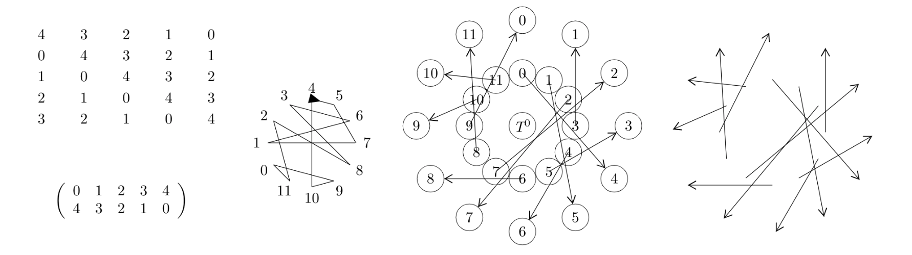

The ddphonism package
Celia Rubio Madrigal
2025/05/13

__________________
Overview

This music-related package focuses on notation from the Twelve-Tone System, also called Dodecaphonism. It provides LaTeX algorithms to generate common dodecaphonic diagrams based off a musical series, or row sequence, of arbitrary length.

__________________
Change history

Version 0.1 (2019/08/10)
- Initial public release

Version 0.2 (2019/09/01)
- Added several new features and options

Version 0.3 (2025-05-13)
- Refactored to remove package dependencies and improve readability of code

__________________
License

Copyright (C) 2025 by Celia Rubio Madrigal <rubiomadrigalcelia@gmail.com>

Permission is granted to distribute and/or modify this work under the terms of the LaTeX Project Public License (LPPL), version 1.3c or later.

The LPPL maintenance status of this work is "maintained".

This work consists of the files ddphonism.sty, ddphonism.pdf and README and the derived file ddphonism.tex.
